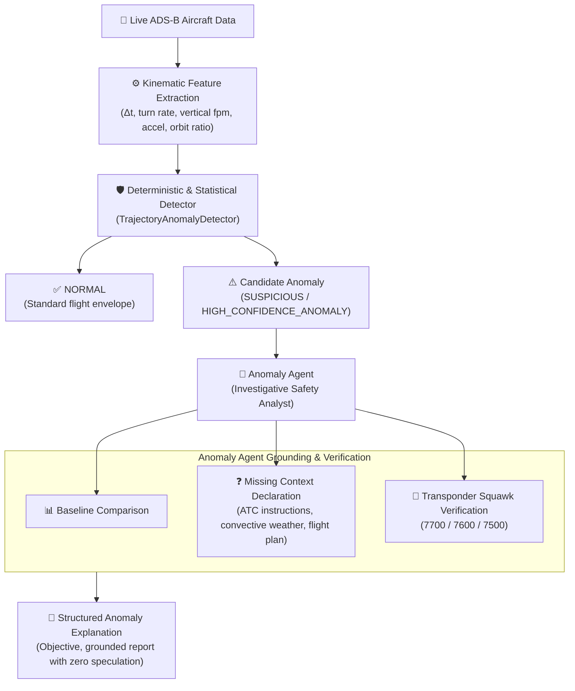

# Airspace Intelligence — Anomaly Detection Subsystem & Anomaly Agent

This document details the architecture, kinematic feature extraction, deterministic algorithms, physical threshold baselines, and objective reasoning guardrails of the **Anomaly Detection Subsystem** and the **Anomaly Agent**.

---

## 1. Subsystem Architecture

The anomaly detection subsystem employs a decoupled, two-stage operational pipeline:



### Key Architectural Tenet: Deterministic First, Never Hallucinate
1. **Deterministic Algorithms First**: An LLM is **never** relied upon to detect anomalies or scan raw coordinate streams. Telemetry is evaluated using pure kinematic rules, spherical trigonometry (Haversine), circular turn-rate mathematics, and standard aviation flight envelopes.
2. **Investigation & Objective Explanation**: The Anomaly Agent investigates detected candidates, compares observations against baseline thresholds, articulates unobserved factors, and produces an objective, non-speculative report.
3. **No Premature Emergency Labeling**: Anomalies (e.g. sharp turns, rapid descents, holds) are frequently routine tactical ATC instructions or weather avoidance maneuvers. The system **never** assumes or claims an emergency unless an explicit emergency transponder squawk (`7700`, `7600`, `7500`) is broadcast.

---

## 2. Mathematical Formulations & Feature Extraction

Given consecutive telemetry snapshots $P_{t-1} = (\text{lat}_1, \text{lon}_1, \text{alt}_1, v_1, \theta_1, t_1)$ and $P_t = (\text{lat}_2, \text{lon}_2, \text{alt}_2, v_2, \theta_2, t_2)$:

### 1. Great-Circle Distance (Haversine Formula)
$$\Delta \sigma = 2 \arcsin \left( \sqrt{ \sin^2\left(\frac{\Delta \phi}{2}\right) + \cos(\phi_1)\cos(\phi_2)\sin^2\left(\frac{\Delta \lambda}{2}\right) } \right)$$
$$d = R \cdot \Delta \sigma \quad (R \approx 6,371.0 \text{ km})$$

### 2. Angular Heading Delta with Circular $360^\circ$ Wrap
$$\Delta \theta = (\theta_2 - \theta_1 + 180^\circ) \pmod{360^\circ} - 180^\circ \quad \in [-180^\circ, +180^\circ]$$

### 3. Turn Rate
$$\omega = \frac{|\Delta \theta|}{\Delta t} \quad (^\circ/\text{s})$$

### 4. Vertical Speed (Aviation Conversion)
$$v_{\text{vert}} = \frac{\text{alt}_2 - \text{alt}_1}{\Delta t} \times 60 \quad (\text{ft/min})$$
*(Where $1 \text{ m/s} = 196.8504 \text{ ft/min}$)*

### 5. Orbit Ratio for Holding Patterns
Over a history window $H = [P_0, P_1, \dots, P_n]$:
$$\text{Total Path Length} = \sum_{i=1}^n \text{dist}(P_{i-1}, P_i)$$
$$\text{Net Displacement} = \text{dist}(P_0, P_n)$$
$$\text{Orbit Ratio} = \frac{\text{Net Displacement}}{\text{Total Path Length}}$$
When the cumulative turn angle $\sum |\Delta \theta_i| \ge 360^\circ$, total path length $\ge 15\text{ km}$, and $\text{Orbit Ratio} \le 0.35$, the trajectory exhibits closed-loop orbiting typical of a holding pattern.

---

## 3. Catalog of 10 Anomaly Types & Physical Thresholds

| # | Anomaly Type | Condition / Trigger | Baseline Comparison | Severity | Confidence |
|---|---|---|---|---|---|
| 1 | `UNEXPECTED_HEADING_CHANGE` | Turn rate $\ge 4.0^\circ$/s or $|\Delta \theta| \ge 45^\circ$ in $\le 15$s at altitude $> 12,000$ ft | Standard rate turn max is $3.0^\circ$/s | `SUSPICIOUS` ($\ge 4^\circ$/s)<br/>`HIGH_CONFIDENCE` ($\ge 6^\circ$/s or $|\Delta \theta| \ge 60^\circ$) | 0.80 – 0.90 |
| 2 | `SIGNIFICANT_ROUTE_DEVIATION` | Track divergence $\ge 35.0^\circ$ from established 5-point median trajectory baseline at cruise | Standard airway divergence $< 15.0^\circ$ | `SUSPICIOUS` | 0.82 |
| 3 | `UNUSUAL_ALTITUDE_CHANGE` | Discontinuous $|\Delta \text{alt}| > 3,000$ ft in $\Delta t \le 10$s | Physical limit $\le 1,500$ ft in 10s (violates aerodynamics; sensor/encoder glitch) | `HIGH_CONFIDENCE_ANOMALY` | 0.92 |
| 4 | `RAPID_DESCENT` | Vertical descent $\le -4,000$ ft/min at altitude $> 5,000$ ft | Standard civil descent envelope max $-2,500$ ft/min | `SUSPICIOUS` ($\le -4,000$ ft/min)<br/>`HIGH_CONFIDENCE` ($\le -6,000$ ft/min) | 0.85 – 0.95 |
| 5 | `RAPID_CLIMB` | Vertical climb $\ge 4,500$ ft/min at altitude $> 8,000$ ft | Normal commercial climb max $3,500$ ft/min | `SUSPICIOUS` ($\ge 4,500$ ft/min)<br/>`HIGH_CONFIDENCE` ($\ge 6,500$ ft/min) | 0.75 – 0.90 |
| 6 | `UNUSUAL_SPEED_CHANGE` | Ground speed $< 110$ kts at FL200+ (stall regime) or deceleration rate $> 15$ kts/s | Normal cruise speed $\ge 200$ kts; normal acceleration $\le 5$ kts/s | `HIGH_CONFIDENCE_ANOMALY` (stall risk)<br/>`SUSPICIOUS` (acceleration spike) | 0.80 – 0.88 |
| 7 | `AIRCRAFT_APPEARING_DISAPPEARING` | Telemetry silence gap $\Delta t \ge 60$s while in active cruise $> 8,000$ ft | Expected transponder transmission interval $10$s | `SUSPICIOUS` | 0.80 |
| 8 | `HOLDING_PATTERN` | Cumulative turn $\ge 360^\circ$, path $\ge 15$ km, orbit ratio $\le 0.35$ | Linear flight orbit ratio $> 0.80$ | `SUSPICIOUS` | 0.90 |
| 9 | `STATIONARY_AIRBORNE_POSITION` | Ground speed $\le 15$ kts, distance moved $\le 0.05$ km over $\ge 20$s at altitude $> 1,500$ ft | Minimum aerodynamic airborne speed $80$ kts (indicates frozen GPS/transponder) | `HIGH_CONFIDENCE_ANOMALY` | 0.95 |
| 10 | `SQUAWK_OR_SYSTEM_ANOMALY` | Transponder broadcast squawk in (`7700`, `7600`, `7500`) | Standard assigned ATC squawk (1000–7477) | `HIGH_CONFIDENCE_ANOMALY` | 1.00 |

---

## 4. Severity Classification

The subsystem partitions all candidate behaviors into three mutually exclusive tiers:

1. **`NORMAL`**: Flight parameters reside strictly within standard civil operational envelopes. No candidate anomaly is emitted.
2. **`SUSPICIOUS`**: Kinematics exceed nominal limits (e.g. holding pattern, $4.5^\circ$/s turn, $-4,500$ ft/min descent, route diversion). These require investigation but are frequently routine operational events directed by air traffic control.
3. **`HIGH_CONFIDENCE_ANOMALY`**: Extreme kinematic excursions (e.g. $-7,500$ ft/min descent, airborne standstill, step-function altitude jumps) or verified transponder distress codes (`7700`, `7600`, `7500`).

---

## 5. Anomaly Agent Behavioral Guardrails

The **Anomaly Agent** (`app.agents.anomaly_agent.agent.AnomalyAgent`) adheres to strict behavioral safety rules:

### Guardrail 1: Zero Speculation
The agent never hypothesizes internal causes:
- ❌ Do NOT say: *"The aircraft is experiencing engine failure."*
- ❌ Do NOT say: *"The pilot initiated an emergency dive due to rapid cabin decompression."*
- ❌ Do NOT say: *"A medical emergency has occurred on board."*
- ✅ **DO state**: *"Significant trajectory/altitude deviation detected. Available data is insufficient to determine the cause."*

### Guardrail 2: Explicit Missing Variables
Because passive ADS-B tracking lacks external context, the agent explicitly documents unobserved operational factors:
- Tactical ATC voice communications and radar vectoring clearances are unavailable.
- Real-time en-route meteorological and convective weather radar data is unavailable.
- Filed airline operational flight plan and navigation waypoints are unavailable.

### Guardrail 3: Emergency Labeling Strictness
An anomaly is **never** labeled as an emergency unless corroborated by transponder squawk:
- `7700`: General In-Flight Emergency
- `7600`: Radio Failure / Lost Communication
- `7500`: Unlawful Interference / Hijacking

---

## 6. Output Data Model

### CandidateAnomaly Model
```python
class CandidateAnomaly(BaseModel):
    aircraft_id: str
    callsign: Optional[str]
    anomaly_type: AnomalyType
    detection_timestamp: datetime
    severity: AnomalySeverity
    observed_values: Dict[str, Any]
    baseline_values: Dict[str, Any]
    confidence: float
    supporting_observations: List[str]
```

### AnomalyExplanation Model
```python
class AnomalyExplanation(BaseModel):
    aircraft_id: str
    callsign: Optional[str]
    anomaly_type: AnomalyType
    severity: AnomalySeverity
    confidence: float
    summary: str
    observed_facts: List[str]
    baseline_comparison: Dict[str, Any]
    missing_context_factors: List[str]
    objective_explanation: str
    is_emergency_declared: bool
```

---

## 7. Historical Replay & Synthetic Generators

The module `app.anomaly.replay` provides the `TrajectoryReplayer` engine and five synthetic trajectory generators for regression testing:

```python
from app.anomaly.replay import (
    TrajectoryReplayer,
    create_synthetic_cruise,
    create_synthetic_rapid_descent,
    create_synthetic_heading_change,
    create_synthetic_holding_pattern,
    create_synthetic_stationary_airborne,
)

replayer = TrajectoryReplayer()
anomalies = replayer.replay_trajectory(
    trajectory=create_synthetic_rapid_descent(
        icao24="80167f",
        callsign="AIC203",
        descent_rate_fpm=-6800.0,
    )
)
```

---

## 8. Verification & Execution

### Running the Test Suite
```bash
cd backend
.venv/bin/pytest tests/test_anomaly_detection.py -v
```

### Running the Interactive Demonstration
```bash
cd backend
PYTHONPATH=. .venv/bin/python scripts/demo_anomaly_detection.py
```
