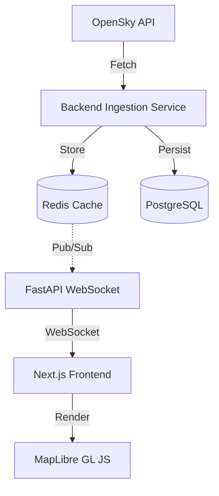

# Architecture

## System Overview
Airspace Intelligence is a real-time aviation tracking platform that ingests live aircraft position data and streams it to an interactive web visualization.

## Architecture Diagram



## Components
- **Frontend (Next.js)**: Map visualization, aircraft display, WebSocket client. Never calls OpenSky directly.
- **Backend (FastAPI)**: REST API, WebSocket server, data ingestion, provider abstraction.
- **Ingestion Service**: Periodically fetches from ADS-B providers, stores in Redis/PostgreSQL.
- **Provider Abstraction**: `ADSBProvider` base class enables swapping data sources.
- **PostgreSQL**: Persistent aircraft state storage.
- **Redis**: Real-time state cache, pub/sub for WebSocket broadcasts.

## Data Flow
1. **Ingestion**: The backend periodically polls the OpenSky API for live ADS-B data.
2. **Processing**: Fetched data is normalized by the Provider Abstraction layer.
3. **Storage**: Current states are cached in Redis for fast access, and historical states are persisted to PostgreSQL.
4. **Distribution**: New data events are published via Redis Pub/Sub, which the FastAPI WebSocket server listens to.
5. **Client Update**: The WebSocket server pushes real-time updates to connected Next.js clients.
6. **Rendering**: MapLibre renders the updated aircraft positions in the browser.

## Key Design Decisions
- **Browser NEVER calls OpenSky**: Prevents rate-limiting issues, exposes a single backend point of control, and keeps API keys secret.
- **Provider Abstraction**: The `ADSBProvider` allows us to easily add or swap ADS-B data sources (e.g., ADSBExchange, FlightAware) without changing core application logic.
- **Monorepo Structure**: Simplifies cross-stack development and dependency management.

## API Endpoints
- `GET /health`: System health check
- `WS /ws`: WebSocket endpoint for real-time aircraft updates
- Future REST endpoints for historical data and analytics

## Directory Structure
```text
airspace-intelligence/
├── backend/          # FastAPI backend service
├── frontend/         # Next.js web application
├── infrastructure/   # Docker Compose and DB init scripts
└── docs/             # Architecture and project documentation
```
