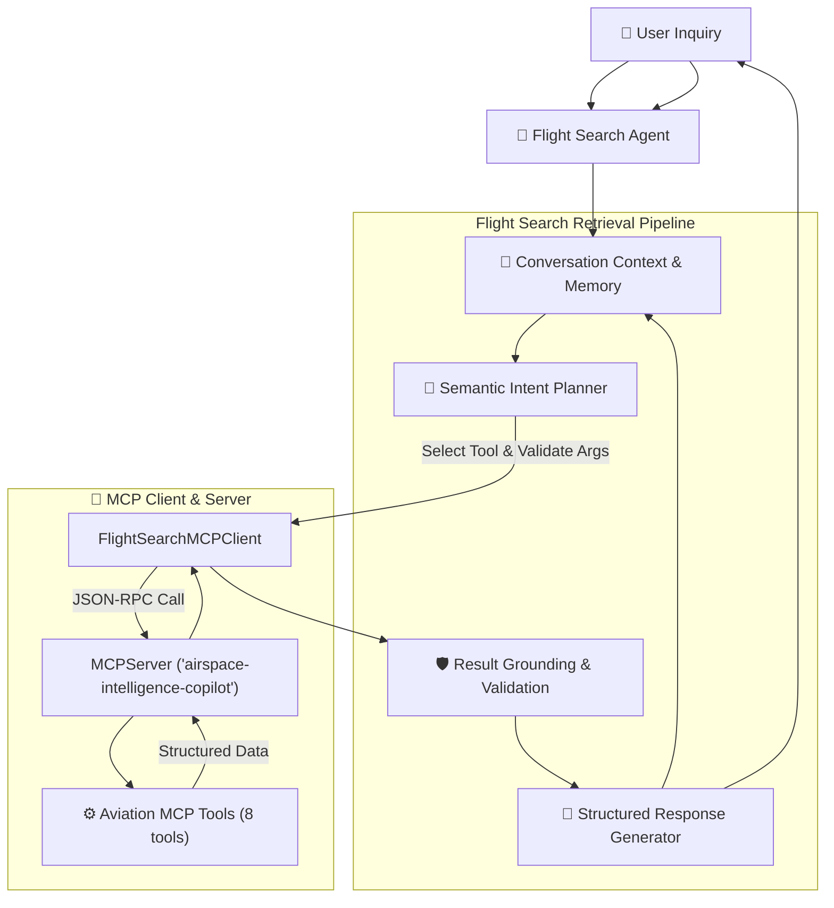

# Airspace Intelligence — Flight Search Agent

This document details the architecture, behavioral rules, conversational state machine, intent planning, and usage of the **Flight Search Agent**.

The Flight Search Agent is an intelligent copilot component whose sole responsibility is **aviation information retrieval**. It interacts strictly with the aviation MCP tools, adheres to zero-hallucination grounding principles, and maintains conversational context across multi-turn follow-up inquiries.

---

## 1. Architecture Overview



---

## 2. Core Operational Rules

### Rule 1: Aviation MCP Tools Only
The agent interacts with the underlying platform **strictly through the official aviation MCP tools**:
- `search_aircraft`
- `get_aircraft`
- `get_aircraft_history`
- `search_aircraft_in_area`
- `get_aircraft_near_airport`
- `get_airport`
- `get_airport_traffic`
- `get_flight_statistics`

No direct access to PostgreSQL, Redis, or external HTTP endpoints is allowed.

### Rule 2: Zero Hallucination Guarantee
Every factual aircraft claim (position, altitude, ground speed, heading, status) must originate from a verified tool execution result. The agent never invents or guesses flight data.

### Rule 3: Explicit Unavailable Data Policy
If an aircraft is not detected or data is absent:
- For missing aircraft: Explicitly declare the flight as unavailable or out of transponder coverage.
- For missing attributes: Clearly state that the specific telemetry field is unavailable in the live transponder broadcast.

### Rule 4: Clear Data Categorization
Responses clearly partition information into:
- **Observed Live Data**: Transponder telemetry (coordinates, altitude in feet/metres, speed in knots/km/h, heading, vertical rate).
- **Historical Data**: Recorded past track points from `get_aircraft_history`.
- **Derived Calculations**: Spatial distances from geographic targets and flight phase heuristic classifications.
- **Status / Assumptions**: Clear declaration of flight status (Airborne, On Ground, or Transponder Unavailable).

### Rule 5: Conversational Memory & Pronoun Resolution
The agent maintains an active `ConversationContext` tracking:
- `active_aircraft`: Most recently referenced aircraft (`icao24`, `callsign`, coordinates, altitude, speed).
- `active_airport`: Most recently referenced airport (`code`, `name`, coordinates).

When the user asks follow-up questions using pronouns (*"What's its altitude?"*, *"How fast is it going?"*, *"Where is it?"*), the agent resolves the pronoun to `active_aircraft` and fetches the targeted telemetry.

---

## 3. Example Multi-Turn Interactions

### Multi-Turn Dialogue 1: Pronoun Follow-up
```text
User: Where is AI203?
Agent: Flight AIC203 (ICAO 80167f):
       Observed Live Data:
       - Coordinates: lat 28.54, lon 77.12
       - Altitude: 10,499 ft (3,200 m)
       - Ground Speed: 350 kts (648 km/h)
       - Heading: 310.0°
       - Country of Registration: India
       Operational Status: Aircraft is currently Airborne.

User: What's its altitude?
Agent: AIC203 Altitude:
       - Observed Live Data: Altitude is 10,499 ft (3,200 m).
       - Status: Airborne.

User: How fast is it going?
Agent: AIC203 Speed:
       - Observed Live Data: Ground speed is 350 knots (648 km/h).
```

### Dialogue 2: Geographic & Radial Distance Search
```text
User: What aircraft are within 100 km of Mumbai?
Agent: Discovered 2 aircraft within 100 km of coordinates (19.0896, 72.8656):
       (Sorted by proximity)
       1. AIC101 (800201) — 1.9 km away | 128 ft, Ground (India)
       2. SEJ512 (800abc) — 6.9 km away | 4,921 ft, Airborne (India)
```

### Dialogue 3: Missing Aircraft (Zero Hallucination)
```text
User: Where is flight AI9999?
Agent: Aircraft matching 'AIC9999' is currently unavailable and not tracked within transponder coverage.
       The flight may not have departed yet, has already landed, or is outside transponder coverage.
```

---

## 4. Usage in Python

```python
from app.agent import FlightSearchAgent, FlightSearchMCPClient
from app.domain.aircraft_service import AircraftService
from app.domain.airport_service import AirportService
from app.tools.registry import create_default_registry

# Setup registry and MCP client
registry = create_default_registry(aircraft_service, airport_service)
mcp_client = FlightSearchMCPClient(registry=registry)
agent = FlightSearchAgent(mcp_client=mcp_client)

# Ask questions with optional conversation context tracking
response = await agent.ask("Which aircraft are near Delhi?")
print(response.text)

# Multi-turn follow-up with conversation_id
turn1 = await agent.ask("Where is AI203?", conversation_id="session-1")
turn2 = await agent.ask("What's its altitude?", conversation_id="session-1")
turn3 = await agent.ask("How fast is it going?", conversation_id="session-1")
```

---

## 5. Automated Verification

Run unit and multi-turn agent tests:
```bash
cd backend
.venv/bin/pytest tests/test_flight_search_agent.py -v
```

Run interactive demo:
```bash
cd backend
PYTHONPATH=. .venv/bin/python scripts/demo_flight_search_agent.py
```
