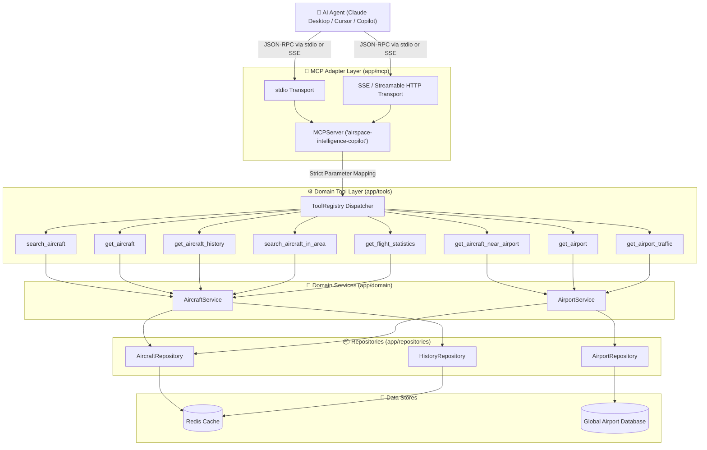

# Airspace Intelligence — Model Context Protocol (MCP) Server

This document details the architecture, configuration, tools, security model, and local startup instructions for the **Airspace Intelligence MCP Server**.

The MCP server exposes the 8 core aviation domain tools to AI agents (such as Claude Desktop, Cursor, and custom agentic frameworks) using the official Model Context Protocol (MCP) Python SDK.

---

## 1. Architecture & Security Model

The MCP layer is strictly a **protocol and presentation adapter** that mounts on top of the existing aviation domain architecture:



### Least Privilege Security Invariants

* **No Direct Database Access**: The MCP server never establishes arbitrary SQL query interfaces or exposes raw Redis key commands.
* **No Arbitrary HTTP/Network Calls**: The server cannot make external network calls on behalf of the LLM.
* **Strict Input Validation**: Every tool argument is sanitized, typed, and boundary-checked (e.g. latitude within `[-90, 90]`, ICAO hex matching `^[0-9a-fA-F]{6}$`, radius `> 0`) using Pydantic V2. Invalid inputs are rejected with clear error messages before hitting the domain service.
* **Pure Structured Output**: Tools return clean, typed JSON data instead of verbose unstructured prose, ensuring maximum predictability for downstream LLM reasoning.

---

## 2. Available Aviation Tools

The MCP server exposes exactly 8 whitelisted tools:

| # | Tool Name | Description | Key Inputs | Structured Output |
|---|---|---|---|---|
| 1 | `search_aircraft` | Search active flights by callsign, ICAO hex, country, or bounding box | `callsign`, `icao24`, `country`, `bounds`, `limit` | `SearchAircraftOutput` |
| 2 | `get_aircraft` | Get real-time normalized state for a single aircraft | `icao24` (6 hex chars) | `GetAircraftOutput` |
| 3 | `get_aircraft_history` | Chronological position and altitude telemetry track | `icao24`, `start_time`, `end_time`, `limit` | `GetAircraftHistoryOutput` |
| 4 | `search_aircraft_in_area` | Radial distance search around geographic coordinates | `latitude`, `longitude`, `radius_km`, altitude filters | `SearchAircraftInAreaOutput` |
| 5 | `get_aircraft_near_airport` | Discover aircraft operating around an airport | `airport_code`, `radius_km`, `limit` | `GetAircraftNearAirportOutput` |
| 6 | `get_airport` | Lookup airport metadata (runways, elevation, timezone) | `airport_code` (ICAO/IATA) | `GetAirportOutput` |
| 7 | `get_airport_traffic` | Categorize arrivals, departures, ground, and overflights | `airport_code`, `time_window_minutes`, `radius_km` | `GetAirportTrafficOutput` |
| 8 | `get_flight_statistics` | Regional telemetry metrics & traffic density rating | `bounds`, `country`, `time_window_minutes` | `GetFlightStatisticsOutput` |

---

## 3. Example Tool Calls & Responses

### Example 1: `search_aircraft_in_area`
**Request:**
```json
{
  "name": "search_aircraft_in_area",
  "arguments": {
    "latitude": 28.5665,
    "longitude": 77.1031,
    "radius_km": 50.0,
    "limit": 5
  }
}
```

**Response (`structured_content`):**
```json
{
  "center_latitude": 28.5665,
  "center_longitude": 77.1031,
  "radius_km": 50.0,
  "total_found": 2,
  "aircraft": [
    {
      "aircraft": {
        "icao24": "800abc",
        "callsign": "SEJ202",
        "origin_country": "India",
        "latitude": 28.56,
        "longitude": 77.10,
        "baro_altitude_m": 230.0,
        "altitude_ft": 754.6,
        "velocity_ms": 12.0,
        "speed_kmh": 43.2,
        "speed_knots": 23.3,
        "true_track": 90.0,
        "vertical_rate_ms": 0.0,
        "on_ground": true,
        "last_contact": 1789591441
      },
      "distance_km": 0.78
    },
    {
      "aircraft": {
        "icao24": "80167f",
        "callsign": "AIC101",
        "origin_country": "India",
        "latitude": 28.54,
        "longitude": 77.12,
        "baro_altitude_m": 1200.0,
        "altitude_ft": 3937.0,
        "velocity_ms": 110.0,
        "speed_kmh": 396.0,
        "speed_knots": 213.8,
        "true_track": 310.0,
        "vertical_rate_ms": -4.5,
        "on_ground": false,
        "last_contact": 1789591441
      },
      "distance_km": 3.42
    }
  ]
}
```

### Example 2: `get_airport_traffic`
**Request:**
```json
{
  "name": "get_airport_traffic",
  "arguments": {
    "airport_code": "DEL",
    "radius_km": 80.0
  }
}
```

**Response (`structured_content`):**
```json
{
  "found": true,
  "airport": {
    "icao_code": "VIDP",
    "iata_code": "DEL",
    "name": "Indira Gandhi International Airport",
    "municipality": "New Delhi",
    "country_name": "India",
    "country_iso": "IN",
    "latitude": 28.5665,
    "longitude": 77.1031,
    "elevation_ft": 777.0,
    "timezone": "Asia/Kolkata"
  },
  "time_window_minutes": 60,
  "radius_km": 80.0,
  "total_aircraft": 2,
  "inbound_count": 1,
  "outbound_count": 0,
  "ground_count": 1,
  "en_route_count": 0,
  "traffic": [
    {
      "icao24": "80167f",
      "callsign": "AIC101",
      "origin_country": "India",
      "latitude": 28.54,
      "longitude": 77.12,
      "altitude_m": 1200.0,
      "velocity_kmh": 396.0,
      "true_track": 310.0,
      "vertical_rate_ms": -4.5,
      "distance_to_airport_km": 3.42,
      "flight_phase": "APPROACH"
    },
    {
      "icao24": "800abc",
      "callsign": "SEJ202",
      "origin_country": "India",
      "latitude": 28.56,
      "longitude": 77.10,
      "altitude_m": 230.0,
      "velocity_kmh": 43.2,
      "true_track": 90.0,
      "vertical_rate_ms": 0.0,
      "distance_to_airport_km": 0.78,
      "flight_phase": "ON_GROUND"
    }
  ],
  "summary": "Traffic for Indira Gandhi International Airport (DEL) within 80km: 1 inbound (approach), 0 outbound (departure), 1 on ground, 0 overflying en-route."
}
```

---

## 4. Local Startup Instructions

### Prerequisites
* Python 3.11+
* Active virtual environment (`.venv`) with dependencies installed (`pip install -r requirements.txt`)

### 1. Standard I/O Mode (`stdio`)
Used by default when integrated with desktop clients (e.g. Claude Desktop, Cursor, local agent runners):

```bash
cd backend
PYTHONPATH=. .venv/bin/python -m app.mcp.server --transport stdio
```

### 2. Server-Sent Events / HTTP Mode (`sse`)
Used for remote connections, microservice architectures, or containerized deployments:

```bash
cd backend
PYTHONPATH=. .venv/bin/python -m app.mcp.server --transport sse --host 0.0.0.0 --port 8001
```

* SSE endpoint: `http://localhost:8001/sse`
* Message posting endpoint: `http://localhost:8001/messages/`

---

## 5. Client Integration Configurations

### Claude Desktop Integration
Add the following block to your `claude_desktop_config.json`:
* **macOS**: `~/Library/Application Support/Claude/claude_desktop_config.json`
* **Windows**: `%APPDATA%\Claude\claude_desktop_config.json`

```json
{
  "mcpServers": {
    "airspace-intelligence": {
      "command": "/Users/brmnsaketh/.gemini/antigravity/scratch/airspace-intelligence/backend/.venv/bin/python",
      "args": [
        "-m",
        "app.mcp.server",
        "--transport",
        "stdio"
      ],
      "cwd": "/Users/brmnsaketh/.gemini/antigravity/scratch/airspace-intelligence/backend",
      "env": {
        "PYTHONPATH": ".",
        "REDIS_URL": "redis://localhost:6379/0"
      }
    }
  }
}
```

### Cursor Integration
In Cursor's Settings (`Features` → `MCP`), add a new command-line MCP server:
* **Name**: `airspace-intelligence`
* **Command**: `/Users/brmnsaketh/.gemini/antigravity/scratch/airspace-intelligence/backend/.venv/bin/python -m app.mcp.server --transport stdio`
* **Working Directory**: `/Users/brmnsaketh/.gemini/antigravity/scratch/airspace-intelligence/backend`

---

## 6. Running Integration Tests

To run the MCP server integration test suite:

```bash
cd backend
.venv/bin/pytest tests/test_mcp_server.py -v
```

Output:
```
============================= test session starts ==============================
tests/test_mcp_server.py::test_mcp_server_lists_all_8_tools PASSED       [  7%]
tests/test_mcp_server.py::test_mcp_search_aircraft PASSED                [ 14%]
tests/test_mcp_server.py::test_mcp_get_aircraft PASSED                   [ 21%]
tests/test_mcp_server.py::test_mcp_get_aircraft_history PASSED           [ 28%]
tests/test_mcp_server.py::test_mcp_search_aircraft_in_area PASSED        [ 35%]
tests/test_mcp_server.py::test_mcp_get_aircraft_near_airport PASSED      [ 42%]
tests/test_mcp_server.py::test_mcp_get_airport PASSED                    [ 50%]
tests/test_mcp_server.py::test_mcp_get_airport_traffic PASSED            [ 57%]
tests/test_mcp_server.py::test_mcp_get_flight_statistics PASSED          [ 64%]
tests/test_mcp_server.py::test_mcp_rejects_out_of_range_latitude PASSED  [ 71%]
tests/test_mcp_server.py::test_mcp_rejects_negative_radius PASSED        [ 78%]
tests/test_mcp_server.py::test_mcp_rejects_excessive_limit PASSED        [ 85%]
tests/test_mcp_server.py::test_mcp_least_privilege_audit PASSED          [ 92%]
tests/test_mcp_server.py::test_mcp_rejects_unregistered_tool_call PASSED [100%]
============================== 14 passed in 0.38s ==============================
```
