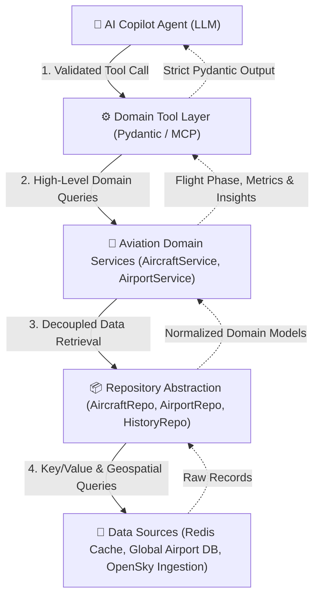

# Airspace Intelligence — Aviation Domain Tool Layer

This document describes the design, architecture, schemas, and operational mechanics of the **Aviation Domain Tool Layer** for the **Airspace AI Copilot**.

---

## 1. Architecture Overview

To ensure safety, determinism, and prevent hallucinations or unauthorized data access, the Airspace AI Copilot follows a strict five-tier isolation architecture:



### Architectural Principles

1. **Zero Direct LLM Access**: The AI model has **no direct network access** to Redis, PostgreSQL, OpenSky Network, or external APIs.
2. **Schema Invariants**: Every tool defines strict Pydantic models for both inputs (`extra="forbid"`) and outputs. Inputs are validated before execution, and outputs are strictly typed before return.
3. **Deterministic Domain Math**: Spatial proximity (Haversine formula), flight phase classification (approach vs departure vs cruise), unit conversions (m/s to knots and km/h, metres to feet), and traffic density calculations are computed in pure Python domain code rather than estimated by the LLM.
4. **Standard MCP Compatibility**: Every tool implements `.to_mcp_tool_definition()` to produce JSON Schema tool manifests directly compatible with Model Context Protocol (MCP), Anthropic Claude, OpenAI Function Calling, and Google Gemini Function Calling.

---

## 2. Tool Catalog

The platform implements 8 core aviation domain tools:

| # | Tool Name | Description | Key Inputs | Primary Output |
|---|---|---|---|---|
| 1 | `search_aircraft` | Filter active aircraft by identifier or geographic area | `callsign`, `icao24`, `country`, `bounds`, `limit` | List of normalized aircraft states |
| 2 | `get_aircraft` | Retrieve single aircraft real-time telemetry | `icao24` (hex) | Latest aircraft state or not-found status |
| 3 | `get_aircraft_history` | Chronological position and altitude track | `icao24`, `start_time`, `end_time`, `limit` | Time-series sequence of positions |
| 4 | `search_aircraft_in_area` | Radial geographic search around coordinates | `latitude`, `longitude`, `radius_km`, altitude filters | Aircraft sorted by radial distance |
| 5 | `get_aircraft_near_airport` | Find aircraft operating in airport vicinity | `airport_code` (ICAO/IATA), `radius_km`, `limit` | Airport details + nearby flights |
| 6 | `get_airport` | Airport metadata and operational coordinates | `airport_code` (ICAO/IATA) | Airport name, city, country, coords, tz |
| 7 | `get_airport_traffic` | Analyze arrivals, departures, ground movements | `airport_code`, `time_window_minutes`, `radius_km` | Inbound, outbound, ground counts + summary |
| 8 | `get_flight_statistics` | Regional telemetry metrics & density assessment | `bounds`, `country`, `time_window_minutes` | Altitude/speed stats + traffic density |

---

## 3. Tool Specifications & Schemas

### Tool 1: `search_aircraft`
Search currently active aircraft using callsign, 24-bit ICAO hex code, registration country, or geographic bounding box.

#### Input Schema (`SearchAircraftInput`)
```json
{
  "callsign": "string (optional, 1-10 chars, e.g. 'AIC101')",
  "icao24": "string (optional, 6 hex chars, e.g. '80167f')",
  "country": "string (optional, e.g. 'India')",
  "bounds": {
    "lamin": "float (-90 to 90)",
    "lomin": "float (-180 to 180)",
    "lamax": "float (-90 to 90)",
    "lomax": "float (-180 to 180)"
  },
  "limit": "integer (1-500, default 50)"
}
```

#### Output Schema (`SearchAircraftOutput`)
```json
{
  "total_matched": "integer",
  "aircraft": [
    {
      "icao24": "string",
      "callsign": "string or null",
      "origin_country": "string",
      "latitude": "float or null",
      "longitude": "float or null",
      "baro_altitude_m": "float or null",
      "altitude_ft": "float or null",
      "velocity_ms": "float or null",
      "speed_kmh": "float or null",
      "speed_knots": "float or null",
      "true_track": "float or null",
      "vertical_rate_ms": "float or null",
      "on_ground": "boolean",
      "last_contact": "integer (epoch seconds)"
    }
  ]
}
```

---

### Tool 2: `get_aircraft`
Retrieve the latest normalized real-time state for an aircraft by its 24-bit ICAO hex code.

#### Input Schema (`GetAircraftInput`)
```json
{
  "icao24": "string (6 hex chars, e.g. '80167f')"
}
```

#### Output Schema (`GetAircraftOutput`)
```json
{
  "found": "boolean",
  "icao24": "string",
  "aircraft": "AircraftStateData or null",
  "message": "string or null"
}
```

---

### Tool 3: `get_aircraft_history`
Retrieve the chronological historical position track and telemetry history for an aircraft within an optional time range.

#### Input Schema (`GetAircraftHistoryInput`)
```json
{
  "icao24": "string (6 hex chars)",
  "start_time": "datetime (ISO 8601, optional)",
  "end_time": "datetime (ISO 8601, optional)",
  "limit": "integer (1-1000, default 100)"
}
```

#### Output Schema (`GetAircraftHistoryOutput`)
```json
{
  "icao24": "string",
  "record_count": "integer",
  "history": [
    {
      "icao24": "string",
      "callsign": "string or null",
      "timestamp": "integer (epoch seconds)",
      "latitude": "float or null",
      "longitude": "float or null",
      "baro_altitude": "float or null",
      "velocity": "float or null",
      "true_track": "float or null",
      "vertical_rate": "float or null",
      "on_ground": "boolean"
    }
  ]
}
```

---

### Tool 4: `search_aircraft_in_area`
Find all active aircraft currently within a specified radial distance (in km) from a geographic coordinate, sorted by distance from center.

#### Input Schema (`SearchAircraftInAreaInput`)
```json
{
  "latitude": "float (-90.0 to 90.0)",
  "longitude": "float (-180.0 to 180.0)",
  "radius_km": "float (0.0 to 2000.0 km)",
  "min_altitude_m": "float (optional, >= 0.0)",
  "max_altitude_m": "float (optional, >= 0.0)",
  "limit": "integer (1-500, default 50)"
}
```

#### Output Schema (`SearchAircraftInAreaOutput`)
```json
{
  "center_latitude": "float",
  "center_longitude": "float",
  "radius_km": "float",
  "total_found": "integer",
  "aircraft": [
    {
      "aircraft": "AircraftStateData",
      "distance_km": "float"
    }
  ]
}
```

---

### Tool 5: `get_aircraft_near_airport`
Find all active aircraft currently operating within a specified radial distance around an airport.

#### Input Schema (`GetAircraftNearAirportInput`)
```json
{
  "airport_code": "string (3-4 alphanumeric characters, e.g. 'VIDP' or 'DEL')",
  "radius_km": "float (default 50.0 km, max 500.0 km)",
  "limit": "integer (1-500, default 50)"
}
```

#### Output Schema (`GetAircraftNearAirportOutput`)
```json
{
  "found": "boolean",
  "airport": {
    "icao_code": "string",
    "iata_code": "string or null",
    "name": "string",
    "municipality": "string",
    "country_name": "string",
    "country_iso": "string",
    "latitude": "float",
    "longitude": "float",
    "elevation_ft": "float or null",
    "timezone": "string or null"
  },
  "radius_km": "float",
  "total_found": "integer",
  "nearby_aircraft": [
    {
      "aircraft": "AircraftStateData",
      "distance_km": "float"
    }
  ],
  "message": "string or null"
}
```

---

### Tool 6: `get_airport`
Lookup airport metadata, geographic coordinates, municipality, country, and timezone by 4-letter ICAO code or 3-letter IATA code.

#### Input Schema (`GetAirportInput`)
```json
{
  "airport_code": "string (3-4 alphanumeric characters, e.g. 'KJFK', 'LHR')"
}
```

#### Output Schema (`GetAirportOutput`)
```json
{
  "found": "boolean",
  "airport_code": "string",
  "airport": "AirportMetadataData or null",
  "message": "string or null"
}
```

---

### Tool 7: `get_airport_traffic`
Analyze operational flight traffic around an airport: breakdown of inbound (approach), outbound (departure), ground operations, and en-route overflights with a synthesized plain English summary.

#### Input Schema (`GetAirportTrafficInput`)
```json
{
  "airport_code": "string (e.g. 'DEL', 'VIDP', 'FRA')",
  "time_window_minutes": "integer (5-1440, default 60)",
  "radius_km": "float (0.0 to 300.0 km, default 100.0)"
}
```

#### Output Schema (`GetAirportTrafficOutput`)
```json
{
  "found": "boolean",
  "airport": "AirportMetadataData or null",
  "time_window_minutes": "integer",
  "radius_km": "float",
  "total_aircraft": "integer",
  "inbound_count": "integer",
  "outbound_count": "integer",
  "ground_count": "integer",
  "en_route_count": "integer",
  "traffic": [
    {
      "icao24": "string",
      "callsign": "string or null",
      "origin_country": "string",
      "latitude": "float or null",
      "longitude": "float or null",
      "altitude_m": "float or null",
      "velocity_kmh": "float or null",
      "true_track": "float or null",
      "vertical_rate_ms": "float or null",
      "distance_to_airport_km": "float",
      "flight_phase": "APPROACH | DEPARTURE | ON_GROUND | EN_ROUTE"
    }
  ],
  "summary": "string"
}
```

#### Flight Phase Heuristic
Flight phase classification is determined deterministically in `app.domain.models.classify_flight_phase`:
- **`ON_GROUND`**: When `on_ground == True` or altitude < 150m above airport elevation.
- **`APPROACH`**: When descending (`vertical_rate < -1.0 m/s`), within 120km of airport, altitude < 4,500m, and heading oriented towards the airport (within ±60° of bearing).
- **`DEPARTURE`**: When climbing (`vertical_rate > 1.5 m/s`), within 80km of airport, altitude < 4,500m, and heading oriented away from the airport.
- **`EN_ROUTE`**: Default phase for cruising flights passing overhead.

---

### Tool 8: `get_flight_statistics`
Compute real-time flight telemetry statistics, altitude distributions, speed percentiles, and airspace traffic density rating for an optional region or country.

#### Input Schema (`GetFlightStatisticsInput`)
```json
{
  "bounds": "GeoBoundingBox (optional)",
  "country": "string (optional)",
  "time_window_minutes": "integer (optional)"
}
```

#### Output Schema (`GetFlightStatisticsOutput`)
```json
{
  "total_aircraft": "integer",
  "airborne_count": "integer",
  "on_ground_count": "integer",
  "altitude_stats": {
    "min_altitude_m": "float",
    "max_altitude_m": "float",
    "avg_altitude_m": "float",
    "median_altitude_m": "float",
    "low_altitude_count": "integer (< 3,000m / FL100)",
    "mid_altitude_count": "integer (3,000m - 8,000m)",
    "cruise_altitude_count": "integer (8,000m - 12,000m / FL260-FL390)",
    "stratosphere_altitude_count": "integer (> 12,000m / FL390+)"
  },
  "speed_stats": {
    "min_speed_kmh": "float",
    "max_speed_kmh": "float",
    "avg_speed_kmh": "float",
    "median_speed_kmh": "float"
  },
  "traffic_density": "LOW | MODERATE | HIGH | VERY_HIGH",
  "top_origin_countries": [
    {
      "country": "string",
      "count": "integer"
    }
  ],
  "calculated_at": "datetime (ISO 8601)"
}
```

---

## 4. MCP Manifest Export

Each tool instance provides `.to_mcp_tool_definition()`. The `ToolRegistry` aggregates all 8 tools into a single MCP manifest:

```python
from app.tools import create_default_registry

registry = create_default_registry(aircraft_service, airport_service)
manifest = registry.get_mcp_manifest()
```

Sample output:
```json
[
  {
    "name": "search_aircraft",
    "description": "Search currently active aircraft using callsign, 24-bit ICAO hex code...",
    "inputSchema": {
      "type": "object",
      "properties": {
        "callsign": {"type": "string", "description": "Flight callsign"},
        "icao24": {"type": "string", "pattern": "^[0-9a-fA-F]{6}$"},
        "country": {"type": "string"},
        "bounds": {"$ref": "#/$defs/GeoBoundingBox"},
        "limit": {"type": "integer", "default": 50}
      },
      "additionalProperties": false
    }
  }
]
```

---

## 5. Usage in Code

### Executing Tools via Registry Dispatcher
```python
from app.tools import create_default_registry

registry = create_default_registry(aircraft_service, airport_service)

# Dispatch with dictionary parameters
result = await registry.execute("search_aircraft_in_area", {
    "latitude": 28.5665,
    "longitude": 77.1031,
    "radius_km": 80.0
})

print(f"Discovered {result.total_found} aircraft nearby.")
```

---

## 6. Verification and Testing

Run unit tests:
```bash
cd backend
.venv/bin/pytest tests/test_domain_tools.py -v
```

Run interactive demo:
```bash
cd backend
PYTHONPATH=. .venv/bin/python scripts/demo_tools.py
```
